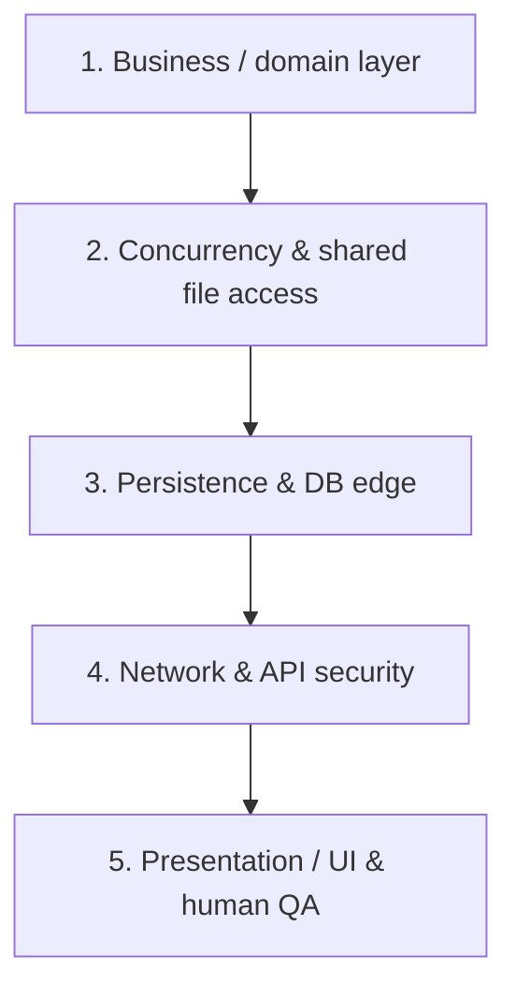

# Critical Change Evaluator (strict)

This skill defines a standard protocol for evaluating, auditing and subjecting
to rigorous technical review any code change, PR or autonomous task. It applies
to any language (Rust, TypeScript/JavaScript, Python, Dart, SQL).

---

## 1. Critical-impact taxonomy (language-agnostic)

Before approving or merging any change, classify its criticality from
structural patterns:

| Risk level | Detected patterns (any language) | Typical examples | Required scrutiny |
|---|---|---|---|
| 🔴 **CRITICAL** | Auth, tokens, cryptography, sessions, credentials, `DROP`, `ALTER`, DB migrations, distributed mutexes/locks, shared file access, permissions, CORS. | A Rust lock guard around a shared resource, JWT validation in TS, `ALTER TABLE` in SQL, login middleware. | Mandatory human review + formal layer verification + QA in a sandbox. |
| 🟡 **MEDIUM** | New API endpoints, shared domain models, global state stores, background workers. | `/api/tasks` routes, Pinia/Svelte/Zustand stores, cron jobs. | Assisted review with a Definition-of-Done checklist and contract validation. |
| 🟢 **LOW** | Cosmetic CSS changes, isolated HTML templates, text, static assets, docs. | Tailwind classes, button labels, `README.md`. | Automatic approval if CI and tests pass 100%. |

---

## 2. Five pillars of multi-layer evaluation

The strict evaluator analyzes each change through five layers:

1. **Business layer (domain invariants):**
   - Which business rule does this task satisfy?
   - Does it break a fundamental invariant (e.g. negative balances, illegal states, unauthorized roles)?
2. **Concurrency & shared file access (execution and safety):**
   - Is there a risk of race conditions, deadlock or permanent blocking?
   - Are parallel agents guaranteed to touch disjoint sets of files ("file islands")?
3. **Persistence (storage and data-loss risk):**
   - Does it touch tables or schemas? Is the migration safe or destructive?
   - What happens if the network fails mid-transaction?
4. **Network and API security (attack surface):**
   - Are tokens or secrets exposed in logs or HTTP responses?
   - Are authorization headers and CORS validated correctly?
5. **Presentation / UI and human QA (user experience and testing):**
   - How does the user experience this change in the interface?
   - Is there a sandbox where a human can test the UI before deploy?

---

## 3. Interrogation protocol

The strict evaluator takes the role of a **principal software and security architect**:
- **Assumes nothing:** if the agent that proposed the change provided no test evidence for edge cases, the evaluator says so explicitly.
- **Explains the blast radius:** which other modules can fail if this change has a subtle bug.
- **Builds the concept map:** traces in three lines how the data travels from the backend to the pixel on screen.
- **Requests human QA:** if the change affects a web component, it provides exact manual test steps.
